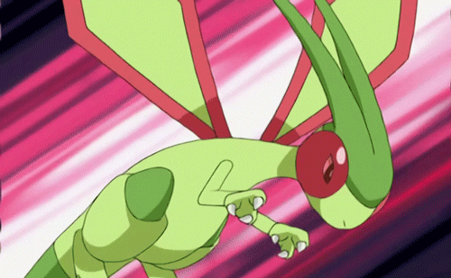

<!-- Rudraksh Bhardwaj | Modern GitHub Profile README -->

##  Welcome!

Hey there!  
I'm **Rudraksh Bhardwaj**, building real-world systems at the intersection of web, data, ML, and AI.

---

## My Tech Stack

<table>
  <tr>
    <td align="center"><b>Programming Languages</b></td>
    <td align="center">
      
      
      
    </td>
  </tr>
  <tr>
    <td align="center"><b>Web Development</b></td>
    <td align="center">
      
      
      
      
      
      
      
    </td>
  </tr>
  <tr>
    <td align="center"><b>Databases</b></td>
    <td align="center">
      
      
      
    </td>
  </tr>
  <tr>
    <td align="center"><b>Data Science & Machine Learning</b></td>
    <td align="center">
      
      
      
      
      
    </td>
  </tr>
  <tr>
    <td align="center"><b>AI / Generative AI</b></td>
    <td align="center">
      
      
    </td>
  </tr>
</table>

---
## Featured Projects

<table>
<tr>
<td valign="top" width="70%">

<b><a href="https://github.com/Rudrakshbhardwaj01/research-paper-summarizer">Research Paper Summarizer</a></b> 
<i>Summarize research papers using Python, LangChain, and HuggingFace.</i> 

<b><a href="https://github.com/Rudrakshbhardwaj01/Shinkansen-Car-Rental">Shinkansen Car Rental</a></b> 
<i>Console-based car rental system implemented in C++.</i> 

<b><a href="https://github.com/Rudrakshbhardwaj01/RAG-implementation-using-LangChain">RAG Implementation using LangChain</a></b> 
<i>Retrieval Augmented Generation (RAG) with Python & LangChain.</i> 

</td>

<td valign="top" width="30%" align="center">

  

</td>
</tr>
</table>

##  GitHub Stats & Contributions

<!-- GitHub Streak -->

 

<!-- Profile Details -->

 

<!-- Stats Card -->

##  Contact

---

  <b>Thank you for visiting!</b>  
  <i>Let's connect, collaborate, and create something extraordinary together. </i>

